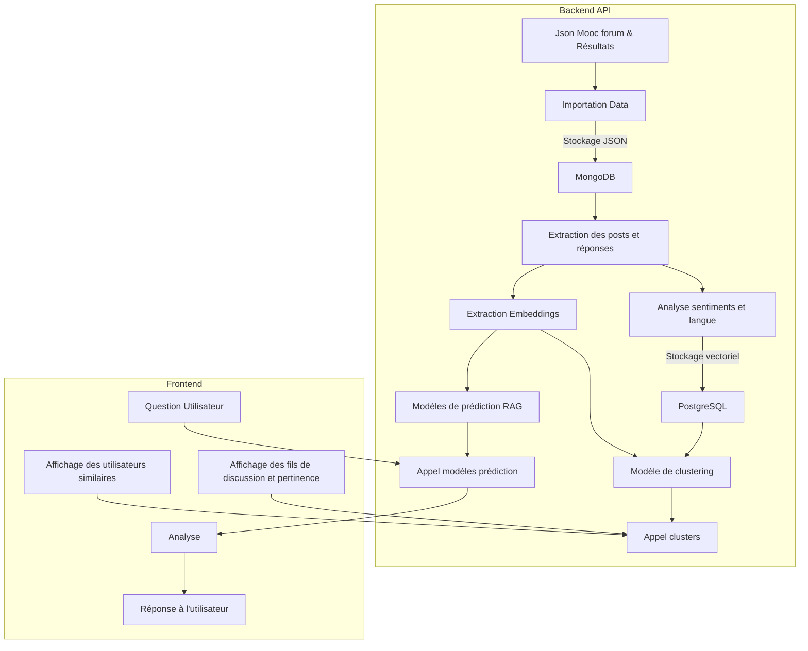

# Rapport de Projet : Monitoring et Analyse des Forums MOOC par l'IA

## Présentation du Projet

Ce projet vise à exploiter les données issues des forums de MOOC (Massive Open Online Courses) afin d'analyser les interactions, d'améliorer la recherche d'information et d'automatiser des tâches d'analyse avancée (clustering, sentiment, similarité). L'application développée propose une interface web permettant :

- La recherche sémantique de fils de discussion à partir d'une question utilisateur (RAG : Retrieval-Augmented Generation).
- Le regroupement automatique des fils de discussion par thématique (clustering de topics).
- L'analyse de sentiment sur les messages d'un fil de discussion.
- L'analyse des profils participants et la recommandation d'utilisateurs similaires.

L'architecture repose sur une API Python/FastAPI, une base MongoDB pour le stockage des données brutes, PostgreSQL pour l'indexation vectorielle et le clustering, et des modèles de NLP pour l'embedding et l'analyse de sentiment. Le projet met l'accent sur l'intégration de traitements IA dans une chaîne de traitement de données structurée, avec une attention particulière portée à la scalabilité et à la réutilisabilité des composants.

## Structure Générale du Projet

- `api/` : API FastAPI, templates HTML (Jinja2), fichiers statiques (CSS), et services Python pour l'IA.
- `scripts/` : Scripts d'analyse, transformation et chargement des données.
- `data/` : Modèles entraînés (ex : BERTopic pour le clustering).
- `notebooks/` : Analyses exploratoires et prototypage.
- `README.md` et `rapport.md` : Documentation et rapport du projet.

## Embedding : Représentation Vectorielle des Messages

### Qu'est-ce qu'un Embedding ?

L'embedding consiste à transformer un texte (mot, phrase, document) en un vecteur dense de dimension fixe, permettant de capturer la sémantique du texte et de comparer efficacement la similarité entre messages.

Dans ce projet, l'embedding est réalisé via le modèle `paraphrase-multilingual-MiniLM-L12-v2` de `sentence-transformers`, générant des vecteurs de 384 dimensions adaptés au multilingue (dont le français).

### Utilisation dans le Projet

- **Indexation** : Chaque message/thread est encodé et stocké dans PostgreSQL (table `embedding`).
- **Recherche sémantique** : Les questions utilisateurs sont encodées et comparées aux messages via la distance cosinus.
- **Clustering** : Les embeddings servent à regrouper messages et utilisateurs selon leur proximité sémantique.
- **Recommandation** : Les profils utilisateurs sont enrichis par l'agrégation des embeddings de leurs messages.

## Fonctionnement de l'Application

### Schéma de fonctionnement (Mermaid)

### Fonctionnement détaillé

1. **Ingestion et Préparation des Données**
    - Les données brutes (JSON, scrapping éventuel) sont stockées dans MongoDB.
    - Extraction des posts, réponses, et métadonnées.
    - Calcul des embeddings pour chaque message, stockage dans PostgreSQL.
    - Analyse de sentiment sur les messages.

2. **API et Interface Utilisateur**
    - FastAPI expose des routes pour la recherche, le clustering, l'analyse de sentiment, et la recommandation.
    - L'utilisateur interagit via une interface web (Jinja2 + JS), posant des questions ou explorant les clusters/topics.

3. **Recherche et Clustering**
    - Les questions sont vectorisées et comparées aux messages indexés pour retrouver les discussions pertinentes.
    - Les messages sont regroupés en topics via BERTopic, et les utilisateurs par clustering KMeans sur leurs embeddings et activités.

4. **Analyse de Sentiment**
    - Un modèle de classification attribue un label de sentiment à chaque message, affiché dans l'interface.

5. **Recommandation de Participants**
    - Les profils utilisateurs sont construits et comparés pour suggérer des participants similaires.

## Services IA et Services Externes Utilisés

### Bases de données

- **MongoDB** : Stockage des données brutes, threads, messages, documents enrichis.
- **PostgreSQL** : Stockage des embeddings vectoriels, résultats de clustering, statistiques, et liens messages-topics.

### Modèles et Librairies IA

- **Sentence Transformers** (`paraphrase-multilingual-MiniLM-L12-v2`) : Génération des embeddings multilingues pour les messages et questions.
- **BERTopic** : Clustering thématique des messages (topics) à partir des embeddings.
- **Scikit-learn** : KMeans pour le clustering des participants, StandardScaler pour la normalisation.
- **Transformers** (`tabularisai/multilingual-sentiment-analysis`) : Analyse de sentiment multilingue sur les messages.

## Améliorations potentielles

- **Intégration de tests unitaires et d'intégration** : Mise en place de suites de tests automatisés pour garantir la robustesse et la non-régression du code, aussi bien sur les services Python que sur l'API.
- **Dockerisation du projet** : Conteneurisation de l'ensemble de l'application (API, bases de données, services IA) pour faciliter le déploiement, la portabilité et la reproductibilité des environnements.
- **Enrichissement des données** : Ajout de données complémentaires (notes, informations détaillées sur les utilisateurs, logs d'activité) pour permettre des analyses plus fines et des fonctionnalités avancées.
- **Amélioration des clusterings** : Exploration de modèles de clustering plus performants, tuning des hyperparamètres, et analyse approfondie des résultats pour une meilleure segmentation thématique et utilisateur.
- **Système RAG avancé** : Intégration d'un LLM (Large Language Model) derrière la recherche de messages par similarité, pour générer des réponses synthétiques et contextuelles à partir des messages retrouvés.
- **Intégration complète des fonctionnalités dans l'API** : Centralisation de toutes les fonctionnalités (recherche, clustering, recommandation, analyse de sentiment) dans l'API pour une meilleure maintenabilité et évolutivité.
- **Ajout d'une authentification** : Mise en place d'un système d'authentification pour sécuriser l'accès à l'application et permettre une gestion personnalisée des utilisateurs.

